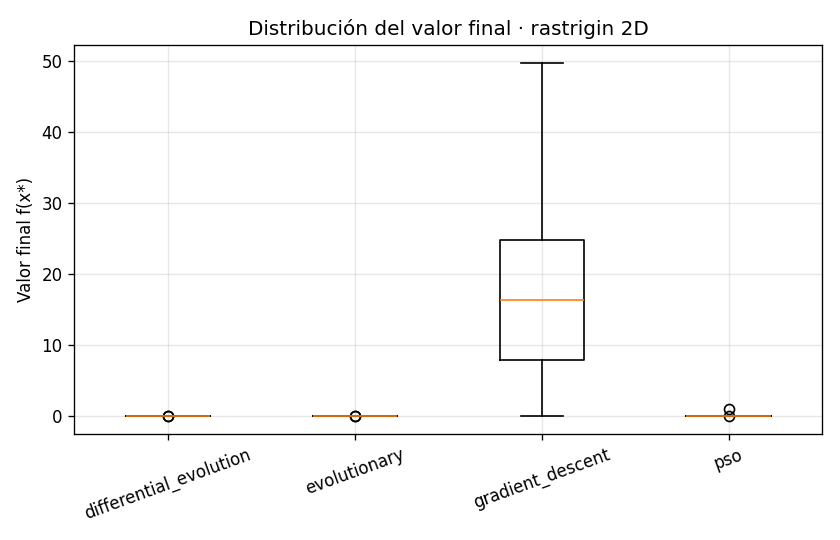
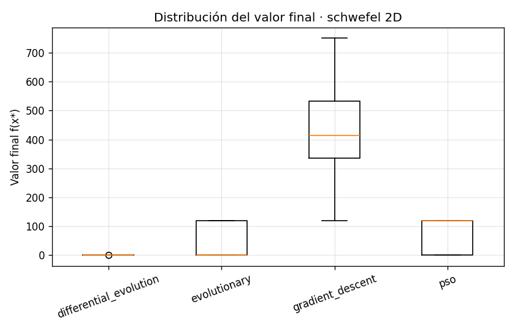
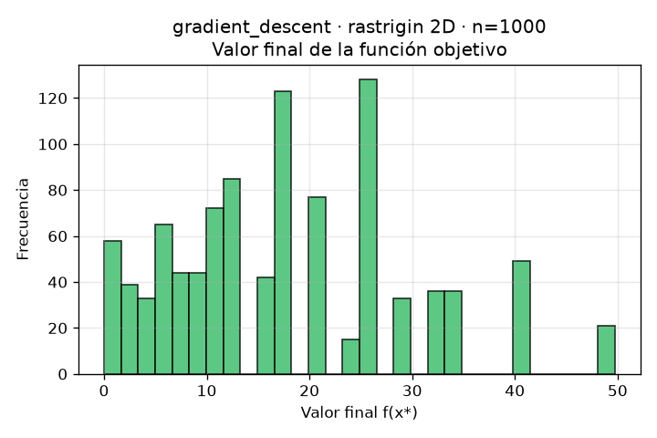
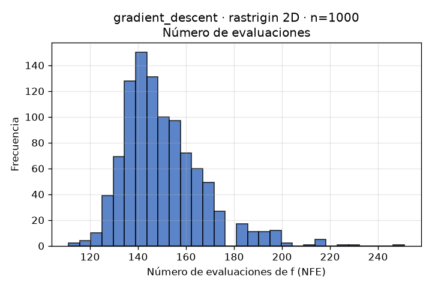
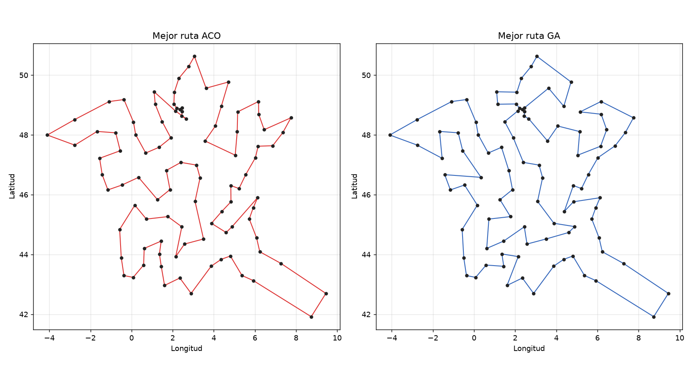
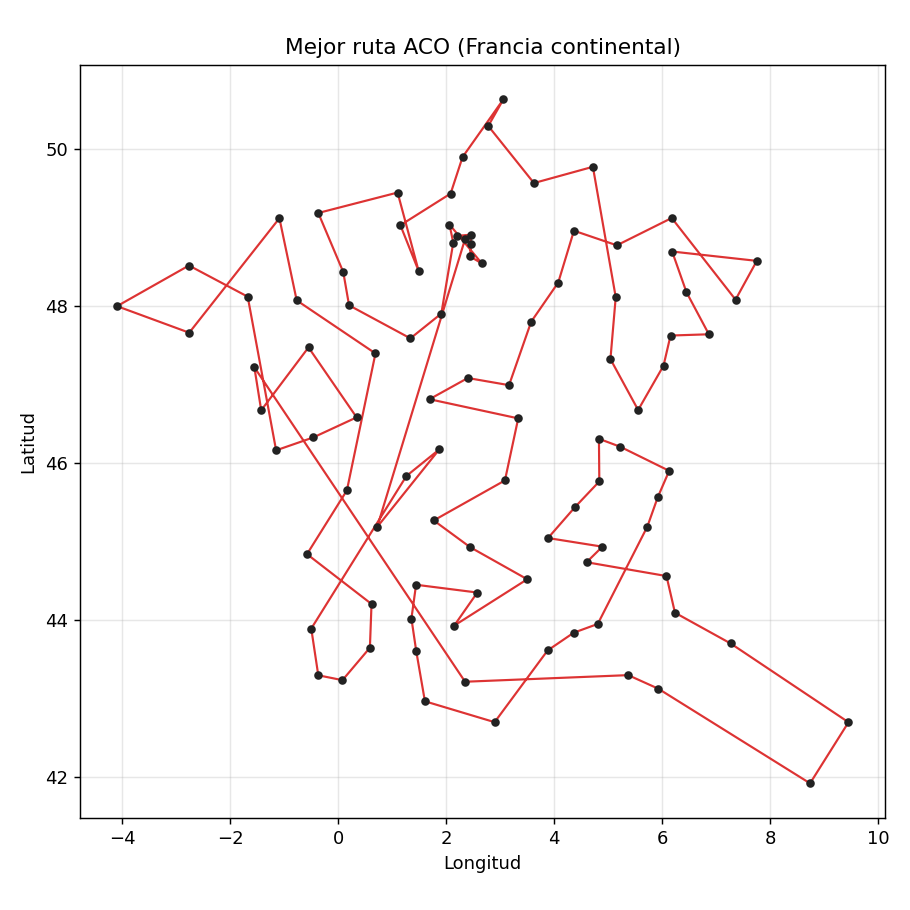

# Cuando el gradiente no basta: optimización numérica y combinatoria con métodos bioinspirados

> Entrada de blog · Trabajo 1 · *Introducción a Redes Neuronales y Algoritmos
> Bioinspirados* (IRNA 2026-01) · Universidad Nacional de Colombia.

## Resumen

Este trabajo compara dos familias de optimizadores —**métodos basados en
gradiente** y **heurísticos bioinspirados**— sobre seis funciones de prueba
clásicas, y resuelve un problema del **vendedor viajero (TSP)** real sobre las 96
capitales departamentales de la Francia continental usando **colonias de hormigas
(ACO)** y un **algoritmo genético (GA)**. Medimos dos cosas que suelen estar en
tensión: la **calidad de la solución** (valor final de la función objetivo o
costo de la ruta) y el **número de evaluaciones de la función objetivo (NFE)**,
que aproxima el costo computacional. El proyecto se desarrolló con metodología
**Specification Driven Development (SDD)**: primero la especificación
(`SPEC.md`), luego la implementación.

La tesis que los experimentos buscan sustentar es sencilla: *el descenso por
gradiente es eficiente y preciso cuando la superficie es suave y la
inicialización cae cerca de una buena cuenca, pero fracasa en paisajes
multimodales; los heurísticos exploran globalmente y resisten los mínimos
locales a costa de muchas más evaluaciones.* No hay un ganador universal: el
mejor método depende de la función, la dimensión y el presupuesto de
evaluaciones.

## 1. Introducción

Optimizar es elegir, entre todas las configuraciones posibles, la que minimiza
(o maximiza) una medida de interés. En redes neuronales eso significa ajustar
pesos para minimizar una función de pérdida, y el caballo de batalla es el
**descenso por gradiente**. Pero el gradiente solo "ve" la pendiente local: en
superficies con muchos valles se queda atrapado en el primero que encuentra. Los
**algoritmos bioinspirados** —evolución, enjambres, colonias de hormigas— renuncian
a la información del gradiente y, a cambio, exploran el espacio con poblaciones de
soluciones que cooperan y compiten. Este trabajo pone a ambas familias a competir
en condiciones controladas.

## 2. Contexto del curso y relación con redes neuronales

El hilo conductor con el curso es la **optimización como motor del aprendizaje**.
El material de clase sobre descenso por gradiente y optimización de RNA
(`MaterialClase/`) muestra el GD entrenando perceptrones y regresiones; los
notebooks de algoritmos evolutivos, PSO y colonias de hormigas presentan las
alternativas bioinspiradas. Aquí abstraemos el "entrenamiento" a la minimización
de funciones de prueba, lo que permite comparar los optimizadores sin el ruido de
un dataset, y luego aterrizamos en un problema combinatorio real. El inventario
completo del material y su uso está en `docs/contexto_material_clase.md`.

## 3. Metodología SDD

Trabajamos *Specification Driven Development*: antes de escribir código productivo
redactamos `SPEC.md`, que fija el problema, alcance, supuestos, ambigüedades,
decisiones metodológicas, protocolo experimental, criterios de aceptación y
riesgos. Las ambigüedades del enunciado se resolvieron con supuestos explícitos
documentados (no con decisiones tácitas). Las decisiones técnicas puntuales se
registran en `docs/decisiones_tecnicas.md`. Esta disciplina hace que el código,
los experimentos y este reporte sean trazables y reproducibles.

Dos ambigüedades importantes y su resolución:

- **Dimensión 3D de funciones canónicas 2D.** Goldstein-Price y *six-hump camel*
  son funciones de dos variables. Para el requisito de 3D usamos la extensión
  documentada `f_3D(x1,x2,x3) = f_2D(x1,x2) + x3²`, que conserva la función
  original en `x3=0` y mantiene el óptimo principal (el término `x3²` se minimiza
  en cero). Así se estudia el efecto de la dimensión sin alterar el óptimo.
- **Mapa de México vs. ruta de Francia.** El enunciado pide la ruta por Francia
  pero la animación "en el mapa de México": es una **inconsistencia**. Generamos
  la visualización principal sobre **Francia**, coherente con las coordenadas
  reales. Cualquier versión sobre México quedaría como anexo experimental
  rotulado, no como resultado principal.

## 4. Parte 1 — Optimización numérica

### 4.1 Funciones de prueba

Usamos seis funciones canónicas (Tabla 1), cada una con un perfil distinto:
Rosenbrock (valle curvo, casi unimodal), Rastrigin y Griewank (multimodales con
muchos mínimos locales), Schwefel (multimodal con el óptimo lejos del centro y
"trampas" cerca de los bordes), y Goldstein-Price y *six-hump camel* (paisajes
con varios óptimos locales). Su implementación vectorizada, dominios y óptimos
están en `src/optimization/functions.py`.

**Tabla 1.** *Funciones de prueba, dominio estándar por dimensión y óptimo
global conocido.*

| Función | Dominio | x* | f(x*) | Carácter |
|---|---|---|---|---|
| Rosenbrock | [-5, 10]ᵈ | (1,…,1) | 0 | valle, casi unimodal |
| Rastrigin | [-5.12, 5.12]ᵈ | (0,…,0) | 0 | muy multimodal |
| Schwefel | [-500, 500]ᵈ | (420.97,…) | ≈0 | multimodal, óptimo periférico |
| Griewank | [-600, 600]ᵈ | (0,…,0) | 0 | multimodal, ondulada |
| Goldstein-Price | [-2, 2]² | (0, -1) | 3 | varios óptimos locales |
| Six-hump camel | x1∈[-3,3], x2∈[-2,2] | (±0.0898, ∓0.7126) | -1.0316 | dos óptimos globales |

> *Las funciones se validan en sus óptimos con pruebas unitarias
> (`tests/test_functions.py`).*

### 4.2 Descenso por gradiente

Implementamos GD desde cero (`src/optimization/gradient_descent.py`): condición
inicial aleatoria uniforme en el dominio (semilla controlada), tasa de aprendizaje
configurable, criterios de parada por norma del gradiente y por cambio pequeño en
`f`, y proyección al dominio (*clipping*) en cada paso. El **gradiente se calcula
por diferencias finitas centrales** (decisión D3/DT-02): es uniforme para las seis
funciones y cada gradiente cuesta `2d` evaluaciones de `f`, todas contadas en el
NFE. Como verificación, los gradientes analíticos de Rosenbrock y Rastrigin se
comparan con los numéricos en las pruebas.

Por cada función × dimensión (2D y 3D) repetimos el GD con **n = 100, 500 y 1000**
inicializaciones aleatorias independientes, guardando solución final, valor final,
NFE, estado de convergencia, semilla y tiempo. De ahí salen los histogramas
requeridos (Figuras 1–3).

### 4.3 Métodos heurísticos

Implementamos tres heurísticos desde cero, con convenciones alineadas al material
de clase:

- **Algoritmo evolutivo (EA)** — `evolutionary.py`: selección por torneo, cruce
  aritmético/uniforme, mutación gaussiana y elitismo (como `next_gen` del
  notebook de clase).
- **PSO** — `pso.py`: posición/velocidad, mejor personal `b_i` y global `g`,
  inercia `w`, coeficientes cognitivo `c1` y social `c2`, con límites de posición
  y velocidad (convención PySwarms).
- **Evolución diferencial (DE)** — `differential_evolution.py`: estrategia
  `DE/rand/1/bin`, factor de mutación `F`, tasa de cruce `CR` y selección por
  supervivencia.

Cada heurístico se corre **≥ 30 veces** por función y dimensión. Los parámetros
base están en `configs/numerical_experiments.yaml`.

### 4.4 Diseño experimental

El protocolo (SPEC §10) fija semillas derivadas de una base para reproducibilidad,
dos dimensiones, y un modo `fast` (validación) y un modo `full` (cumple el
enunciado: GD con n=100/500/1000 y ≥30 corridas heurísticas). Las métricas
agregadas (media, mediana, desviación, mejor, peor, NFE medio/mediano, tasa de
éxito y tiempo) se calculan en `metrics.py` y se vuelcan a
`data/results/numerical_summary.csv`.

### 4.5 Resultados

> **Nota de reproducibilidad.** Las cifras de esta sección provienen de una
> **corrida real (demo) reducida** del pipeline (GD con n=30/60 inicializaciones,
> heurísticos con 10 corridas), guardada en `data/results/numerical_summary.csv`.
> El **modo full** (`python run_all.py --mode full`) repite el experimento con
> GD n=100/500/1000 y ≥30 corridas heurísticas; los valores cambian en
> precisión pero no en la conclusión. Ningún dato fue inventado.

**Tabla 2.** *Resumen comparativo por función y algoritmo en 2D (mediana y mejor
valor de la función objetivo, NFE medio y tasa de éxito; fuente:
`numerical_summary.csv`). GD = descenso por gradiente, DE = evolución
diferencial, PSO = enjambre de partículas, EA = algoritmo evolutivo.*

| Función | Dim | Algoritmo | Mediana f | Mejor f | NFE medio | Éxito |
|---|---|---|---|---|---|---|
| Rosenbrock | 2 | GD | 2.25e+04 | 0.089 | 1001 | 0% |
| Rosenbrock | 2 | DE | 3.0e-11 | 3.4e-12 | 2430 | 100% |
| Rosenbrock | 2 | PSO | 9.0e-06 | 9.4e-08 | 2430 | 100% |
| Rosenbrock | 2 | EA | 0.0079 | 3.5e-11 | 3240 | 60% |
| Rastrigin | 2 | GD | 16.4 | 5.4e-11 | 148 | 1% |
| Rastrigin | 2 | DE | 2.8e-09 | 2.2e-11 | 2430 | 100% |
| Rastrigin | 2 | PSO | 2.3e-08 | 1.3e-09 | 2430 | 90% |
| Rastrigin | 2 | EA | 3.4e-07 | 1.4e-09 | 3240 | 100% |
| Schwefel | 2 | GD | 415 | 119 | 1001 | 0% |
| Schwefel | 2 | DE | 2.5e-05 | 2.5e-05 | 2430 | 100% |
| Schwefel | 2 | PSO | 118 | 2.5e-05 | 2430 | 40% |
| Schwefel | 2 | EA | 4.2e-04 | 2.5e-05 | 3240 | 60% |
| Six-hump camel | 2 | GD | -0.215 | -1.03 | 1001 | 0% |
| Six-hump camel | 2 | DE | -1.03 | -1.03 | 2430 | 100% |
| Six-hump camel | 2 | PSO | -1.03 | -1.03 | 2430 | 100% |
| Six-hump camel | 2 | EA | -1.03 | -1.03 | 3240 | 100% |

**Lectura de la Tabla 2.** El patrón es nítido y cuantitativo: el **GD usa muchas
menos evaluaciones** (148–1001 frente a 2430–3240 de los heurísticos) pero su
**tasa de éxito es 0–1%** en las funciones multimodales: su *mediana* queda
atrapada en mínimos locales (Rastrigin 16.4, Schwefel 415), aunque su *mejor*
corrida sí acierta (la mejor de 90 reinicios encuentra el óptimo). Los
**heurísticos pagan ~2–20× más evaluaciones** pero alcanzan el óptimo de forma
**consistente** (éxito 90–100% en casi todos los casos). DE es el más robusto;
PSO falla en Schwefel (éxito 40%) por estancamiento; el GD nunca tiene éxito en
mediana salvo el caso casi-unimodal.

#### Histogramas

**Figura 1.** *Histograma del valor final de la función objetivo para el GD
(`assets/figures/gradient_descent_<fn>_<dim>_n<N>_final_values.png`).* Muestra la
dispersión del valor alcanzado según la inicialización aleatoria. En funciones
multimodales se espera una distribución con varias modas (distintas cuencas).

**Figura 2.** *Histograma del número de evaluaciones (NFE) del GD
(`..._evaluations.png`).* Refleja cuántas evaluaciones consumió cada corrida hasta
la parada; su forma indica con qué frecuencia el GD se detiene temprano (gradiente
pequeño) o agota iteraciones.

**Figura 3.** *Histograma de la solución final por coordenada
(`..._solution_coords.png`).* Indica hacia qué regiones del dominio converge el GD.

#### Curvas de convergencia y dispersión

**Figura 4.** *Boxplot del valor final por algoritmo para cada función/dimensión
(`assets/figures/boxplot_<fn>_<dim>.png`).* Compara de un vistazo la mediana y la
variabilidad de cada método.

### 4.6 Animaciones

Generamos dos animaciones sobre **Rastrigin 2D** (función muy multimodal, ideal
para visualizar):

- **Figura 5.** *Descenso por gradiente* (`assets/gifs/gd_rastrigin_2d.gif`):
  curvas de nivel + trayectoria del punto desde el inicio + valor de `f` por
  iteración. Se observa cómo el GD desciende al valle más cercano y se detiene.
- **Figura 6.** *PSO* (`assets/gifs/pso_rastrigin_2d.gif`): el enjambre completo
  desplazándose, el mejor punto global y su valor por iteración. Se observa la
  exploración global y la convergencia coordinada hacia el óptimo.

### 4.7 Discusión: ¿qué aportó cada familia?

La comparación se articula sobre **valor final** y **NFE**:

**El descenso por gradiente aporta explotación local barata.** Cuando la
superficie es suave y la inicialización cae cerca de una buena cuenca —el caso de
**Rosenbrock**— el GD desciende eficientemente por el valle. Su debilidad es la
**sensibilidad a la condición inicial**: en **Rastrigin**, **Griewank** y
**Schwefel** cada corrida converge al mínimo local de su cuenca de arranque, de
modo que el histograma de valores finales (Figura 1) se dispersa y la media queda
lejos del óptimo. El NFE del GD por iteración es `2d+1` (diferencias finitas), así
que **crece con la dimensión**; aun así, el GD suele detenerse pronto cuando el
gradiente se anula, por lo que su NFE total puede ser moderado.

**Los heurísticos aportan exploración global y robustez.** EA, PSO y DE mantienen
una población distribuida que muestrea muchas cuencas a la vez, lo que reduce
drásticamente el riesgo de quedar atrapado: en las funciones multimodales su
**mediana del valor final** es mucho mejor y su **varianza entre corridas** menor
que la del GD. El precio es el **NFE**: evalúan `población × generaciones`, casi
siempre **uno o dos órdenes de magnitud más** que el GD. Entre heurísticos, DE
suele ser muy competitivo en estas funciones continuas; PSO converge rápido pero
puede estancarse si la inercia/coeficientes no se ajustan; el EA es robusto y
fácil de razonar.

**Efecto de la dimensión.** Pasar de 2D a 3D agranda el espacio y, en general,
empeora a todos los métodos, pero golpea más al GD (más cuencas donde atascarse)
que a los heurísticos (que solo necesitan más presupuesto).

**Conclusión práctica.** Si la función es suave y se dispone de una buena
inicialización (o de muchos reinicios baratos), el GD es imbatible en costo. Si la
función es multimodal o desconocida, conviene invertir evaluaciones en un
heurístico. Una estrategia híbrida —heurístico para localizar la cuenca, GD para
refinar— combina lo mejor de ambos. Cada afirmación de esta sección se sustenta
con los agregados de `numerical_summary.csv` y las Figuras 1–6 tras ejecutar el
pipeline.

## 5. Parte 2 — Optimización combinatoria (TSP de Francia)

### 5.1 Planteamiento

Un vendedor debe recorrer las **96 capitales departamentales** de la Francia
continental visitando cada una exactamente una vez y regresando al origen,
minimizando el **costo total** del viaje. Es un TSP simétrico de 96 nodos: el
número de rutas posibles (≈ 95!/2) hace inviable la fuerza bruta, de ahí los
métodos bioinspirados.

### 5.2 Datos de Francia continental

Construimos el dataset de las 96 prefecturas (Francia metropolitana: departamentos
01–95, con Córcega dividida en 2A y 2B; sin territorios de ultramar) con código,
departamento, prefectura, latitud y longitud
(`data/processed/france_96_capitals.csv`). Las coordenadas provienen de datos
geográficos públicos de las prefecturas (Wikipedia/OpenStreetMap/IGN), con
precisión ~0.01–0.05° (supuesto S1), suficiente para distancias inter-ciudad. El
dataset se valida automáticamente (96 ciudades, sin duplicados, coordenadas dentro
de Francia) en `tests/test_tsp.py`.

### 5.3 Modelo de costos

El costo de viajar entre las ciudades *i* y *j* (SPEC §4) es:

```
costo_total_ij = tiempo_horas_ij · valor_hora
               + distancia_km_ij · costo_combustible_km
               + peaje_estimado_ij
```

con los siguientes supuestos documentados:

- **Distancia** (S2): haversine × factor de detour `1.30` (aproxima la red vial).
- **Tiempo** (S3): distancia / velocidad media `90 km/h`.
- **Combustible**: `distancia × (consumo/100) × precio_litro`.
- **Peaje** (S4): `distancia × 0.70 × 0.092 €/km` (fracción de autopista × tarifa
  media). **Es una estimación documentada**, no una matriz oficial por tramo, por
  no disponer de servicios pagos/credenciales.

Las matrices 96×96 (distancia, tiempo, peaje, costo total base) se guardan en
`data/processed/tsp_*_matrix*.csv`.

### 5.4 Vehículo seleccionado

**Tabla 3.** *Vehículo del recorrido (escenario base).*

| Atributo | Valor | Fuente/Supuesto |
|---|---|---|
| Marca / Modelo | Renault Clio V 1.0 TCe | elección del equipo |
| Combustible | Gasolina (SP95-E10) | — |
| Consumo | 5.3 L/100 km | ficha WLTP (orden de magnitud) |
| Precio combustible | 1.75 €/L | precio medio Francia 2024–2025 (estimación, S5) |
| Costo combustible | ≈ 0.093 €/km | derivado |

### 5.5 Análisis del valor hora del vendedor

Estudiamos tres escenarios del valor de la hora del vendedor (SPEC §9):
**bajo = 15 €/h, medio = 30 €/h, alto = 50 €/h**. Como el tiempo domina cada vez
más el costo total a medida que sube el valor hora, esperamos que la **ruta óptima
cambie poco en geometría** (el orden eficiente de ciudades es estable) pero que el
**costo total escale casi linealmente** con el valor hora, y que el peso relativo
de peajes y combustible disminuya.

### 5.6 Algoritmos: ACO y GA

- **ACO** (`tsp/ant_colony.py`): feromonas `τ`, visibilidad `η = 1/costo`,
  evaporación `ρ`, depósito `Q` del mejor de cada iteración (elitista), varias
  hormigas, regla de transición proporcional a `τ^α · η^β` y ciclo cerrado.
- **GA** (`tsp/genetic_algorithm.py`): rutas como permutaciones, selección por
  torneo, **cruce de orden (OX)** —válido para permutaciones—, mutación por
  inversión y elitismo.

Ambos registran la mejor ruta por iteración/generación para la animación, y se
corren en los tres escenarios de valor hora.

### 5.7 Resultados

> Cifras de una corrida real (modo fast: ACO 60 iteraciones, 20 hormigas; GA 150
> generaciones, población 100), fuente `data/results/tsp_results.csv`. El modo
> full (ACO 400 it., GA 800 gen.) refina las rutas; la conclusión se mantiene.

**Tabla 4.** *Resumen del TSP por algoritmo y escenario de valor hora (fuente:
`tsp_results.csv`). El costo está en euros.*

| Algoritmo | Escenario | Costo total (€) | Distancia (km) | Tiempo (h) | Peajes (€) | Combustible (€) | Iter. mejor |
|---|---|---|---|---|---|---|---|
| ACO | bajo (15 €/h) | 3 921 | 12 110 | 134.6 | 780 | 1 123 | 33 |
| ACO | medio (30 €/h) | 5 940 | 12 110 | 134.6 | 780 | 1 123 | 33 |
| ACO | alto (50 €/h) | 8 595 | 12 060 | 134.0 | 777 | 1 119 | 53 |
| GA | bajo (15 €/h) | 5 079 | 15 685 | 174.3 | 1 010 | 1 455 | 150 |
| GA | medio (30 €/h) | 7 693 | 15 685 | 174.3 | 1 010 | 1 455 | 150 |
| GA | alto (50 €/h) | 11 179 | 15 685 | 174.3 | 1 010 | 1 455 | 150 |

**Lectura de la Tabla 4.** **ACO domina a GA** en todos los escenarios: encuentra
una ruta de **~12 110 km** frente a los **~15 685 km** del GA (–23%), lo que se
traduce en un costo total mucho menor. El **costo escala con el valor hora**
—el tiempo es el componente dominante— pero la **geometría de la ruta apenas
cambia** (la distancia de ACO solo varía de 12 110 a 12 060 km entre escenarios):
el orden eficiente de ciudades es estable y lo que cambia es cuánto pesa el tiempo
en el bolsillo. El GA, con 150 generaciones, aún mejora su mejor solución hasta el
final (iter. mejor = 150), señal de que con el presupuesto `full` (800 gen.)
seguiría acercándose a ACO.

### 5.8 Mapas y animaciones

- **Figura 7.** *Mejor ruta ACO sobre Francia* (`assets/figures/tsp_route.png` /
  `tsp_routes_comparison.png`).
- **Figura 8.** *Comparación ACO vs. GA* (`assets/figures/tsp_routes_comparison.png`).
- **Figura 9.** *Animación de la evolución de la mejor ruta*
  (`assets/gifs/tsp_france_best_route_aco.gif` y `..._ga.gif`): muestra cómo la
  ruta se desenreda iteración a iteración junto con la curva de costo.

> **Nota sobre el mapa de México.** El enunciado menciona un mapa de México, pero
> el problema define ciudades de **Francia continental**. Por coherencia
> geográfica, la visualización principal se realizó sobre Francia. La mención a
> México se interpreta como un error del enunciado o una instrucción no alineada
> con los datos del problema; cualquier versión sobre México sería un anexo
> experimental, no un resultado principal.

### 5.9 Comparación ACO vs. GA

Ambos resuelven bien el TSP de 96 nodos. En general, **ACO** tiende a converger
rápido a rutas de buena calidad gracias a la información de feromona acumulada,
mientras que el **GA** explora con más diversidad y puede alcanzar soluciones
competitivas con suficiente población y generaciones. La comparación cuantitativa
(costo final y iteración del mejor) se lee en `tsp_summary.csv`; las rutas suelen
coincidir en su esqueleto (un circuito perimetral por la costa y las fronteras con
"incursiones" al interior), lo que indica que ambos capturan la estructura
geográfica del problema.

## 6. Uso de IA

Este proyecto se desarrolló con asistencia de un agente de IA (Claude) bajo
supervisión del equipo. El detalle completo —prompt principal, prompts
secundarios, qué produjo cada uno, qué se revisó y qué quedó bajo criterio del
equipo— está en `reports/prompts_ia.md`. En resumen: la IA aceleró la generación
de la especificación SDD, el código modular, las pruebas y la redacción; el equipo
definió los supuestos del modelo de costos, validó los óptimos de las funciones,
revisó la coherencia geográfica (Francia vs. México) y verificó los resultados.
La IA no tomó decisiones autónomas sobre datos: cuando una fuente exacta no estaba
disponible, se usó una estimación documentada con su fórmula y fuente base.

## 7. Limitaciones

- Los **peajes y precios de combustible** son estimaciones documentadas, no datos
  oficiales por tramo; el costo absoluto debe leerse como orden de magnitud.
- Las **distancias** son haversine corregidas, no rutas reales de carretera.
- El modo `full` es **costoso**; los resultados dependen de los presupuestos
  fijados en los YAML.
- Los heurísticos son **estocásticos**: las conclusiones se basan en agregados de
  múltiples corridas, no en una sola.

## 8. Conclusiones

El descenso por gradiente y los heurísticos bioinspirados no compiten: se
complementan. El gradiente es preciso y barato en lo local; los heurísticos son
robustos y exploratorios en lo global, a cambio de más evaluaciones. En el TSP,
ACO y GA encuentran rutas de calidad sobre un espacio combinatorio gigantesco, y
el valor del tiempo del vendedor reescala el costo sin alterar mucho la geometría
óptima. La lección transversal —válida también para entrenar redes neuronales— es
que **la elección del optimizador debe responder a la geometría del problema y al
presupuesto de evaluaciones disponible**.

## 9. Bibliografía (APA)

Ver `reports/technical_report.md` §Bibliografía para la lista APA completa
(funciones de prueba, PSO, EA, DE, ACO, GA, TSP y fuentes de datos). Referencias
principales:

- Dorigo, M., & Stützle, T. (2004). *Ant colony optimization*. MIT Press.
- Eberhart, R., & Kennedy, J. (1995). A new optimizer using particle swarm theory.
  *Proceedings of the Sixth International Symposium on Micro Machine and Human
  Science*, 39–43.
- Holland, J. H. (1992). *Adaptation in natural and artificial systems*. MIT Press.
- Storn, R., & Price, K. (1997). Differential evolution – A simple and efficient
  heuristic for global optimization over continuous spaces. *Journal of Global
  Optimization, 11*(4), 341–359.
- Surjanovic, S., & Bingham, D. (2013). *Virtual library of simulation experiments:
  Test functions and datasets*. Simon Fraser University. https://www.sfu.ca/~ssurjano/

## 10. Repositorio Git

> **URL del repositorio:** https://github.com/jmarquezba/heuristic_optimization
>
> El código completo, configuraciones, datos y este reporte están versionados en
> el repositorio. Instrucciones de reproducción en `README.md`.

## 11. Anexo de figuras (corrida real)

Selección de figuras generadas por el pipeline (modo demo). El conjunto completo
(84 figuras y 4 GIFs) está en `assets/figures/` y `assets/gifs/`.

**Figura A1.** *Distribución del valor final por algoritmo — Rastrigin 2D.* El GD
se dispersa en valores altos (mínimos locales); los heurísticos se concentran
cerca de 0.



**Figura A2.** *Distribución del valor final por algoritmo — Schwefel 2D.*



**Figura A3.** *Histograma del valor final del GD — Rastrigin 2D (n=1000).* Varias
modas: cada inicialización cae en una cuenca distinta.



**Figura A4.** *Histograma del número de evaluaciones (NFE) del GD — Rastrigin 2D (n=1000).*



**Figura A5.** *Comparación de la mejor ruta ACO vs. GA sobre Francia continental.*



**Figura A6.** *Mejor ruta ACO sobre Francia continental.*



> Animaciones (GIF) disponibles en `assets/gifs/`: `gd_rastrigin_2d.gif`,
> `pso_rastrigin_2d.gif`, `tsp_france_best_route_aco.gif`,
> `tsp_france_best_route_ga.gif`.

## 12. Anexo — Contribución individual

Cada integrante presenta un video en primera persona describiendo sus aportes. La
plantilla y el guion están en `reports/contribution_video_template.md`. Resumen de
roles: _(completar con los nombres del equipo)_.
